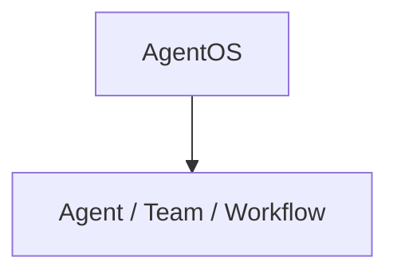

# basic.py — 实现原理分析

<!-- cookbook-py-source:start -->
## 完整源码

```python
"""Minimal example for AgentOS."""

from agno.agent import Agent
from agno.db.postgres import PostgresDb
from agno.models.openai import OpenAIChat
from agno.os import AgentOS
from agno.team import Team
from agno.workflow.step import Step
from agno.workflow.workflow import Workflow

# ---------------------------------------------------------------------------
# Create Example
# ---------------------------------------------------------------------------

# Setup the database
db = PostgresDb(id="basic-db", db_url="postgresql+psycopg://ai:ai@localhost:5532/ai")

# Setup basic agents, teams and workflows
basic_agent = Agent(
    name="Basic Agent",
    db=db,
    enable_session_summaries=True,
    update_memory_on_run=True,
    add_history_to_context=True,
    num_history_runs=3,
    add_datetime_to_context=True,
    markdown=True,
)
basic_team = Team(
    id="basic-team",
    name="Basic Team",
    model=OpenAIChat(id="gpt-4o"),
    db=db,
    members=[basic_agent],
    update_memory_on_run=True,
)
basic_workflow = Workflow(
    id="basic-workflow",
    name="Basic Workflow",
    description="Just a simple workflow",
    db=db,
    steps=[
        Step(
            name="step1",
            description="Just a simple step",
            agent=basic_agent,
        )
    ],
    add_workflow_history_to_steps=True,
)

# Setup our AgentOS app
agent_os = AgentOS(
    description="Example app for basic agent, team and workflow",
    agents=[basic_agent],
    teams=[basic_team],
    workflows=[basic_workflow],
)
app = agent_os.get_app()


# ---------------------------------------------------------------------------
# Run Example
# ---------------------------------------------------------------------------

if __name__ == "__main__":
    """Run your AgentOS.

    You can see the configuration and available apps at:
    http://localhost:7777/config

    """
    agent_os.serve(app="basic:app", reload=True)
```

<!-- cookbook-py-source:end -->

> 源文件：`cookbook/05_agent_os/basic.py`

## 概述

最小 **`AgentOS`** 组合：**`basic_agent`**（**未显式设置 `model`**，依赖框架默认或运行时报错需自查）、**`basic_team`**、**`basic_workflow`**（单 `Step` 绑定 `basic_agent`），共享 **`PostgresDb`**。开启 **session 摘要、记忆、历史、工作流历史注入步骤**。

**核心配置一览：**

| 配置项 | 值 | 说明 |
|--------|------|------|
| `PostgresDb` | `id="basic-db"`，`db_url=postgresql+psycopg://...` | 存储 |
| `basic_agent` | `enable_session_summaries=True`，`update_memory_on_run=True`，`add_history_to_context=True`，`num_history_runs=3` | 无 model |
| `basic_workflow` | `add_workflow_history_to_steps=True` | 步骤可见历史 |
| `Workflow.steps` | `Step(name="step1", agent=basic_agent)` | 单步 |

## 运行机制与因果链

1. HTTP → Agent / Team / Workflow 路由。  
2. **无 `model` 的 Agent**：须确认 Agno 是否注入默认模型；否则 `run` 失败。

## System Prompt 组装

未设 `instructions`/`description`；若 `build_context` 为 True 且仅有默认附加段，则 system 极短或由模型默认指令填充。

### 还原

```text
（无显式 instructions；若有 markdown 默认附加：Use markdown to format your answers.）
```

## 完整 API 请求

取决于解析到的主模型；若未配置 model 则**不适用**。

## Mermaid 流程图



## 关键源码文件索引

| 文件 | 作用 |
|------|------|
| `agno/os` | `AgentOS` |
