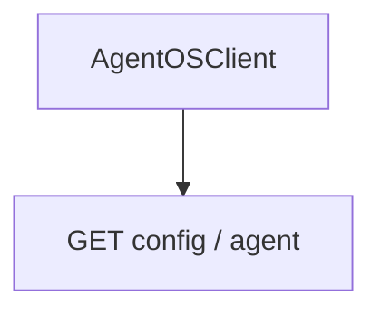

# 01_basic_client.py — 实现原理分析

> 源文件：`cookbook/05_agent_os/client/01_basic_client.py`

## 概述

演示 **`AgentOSClient`**：`base_url="http://localhost:7777"`，**`aget_config()`** 拉取 OS 配置并打印 agents/teams/workflows；**`aget_agent(agent_id)`** 取单个 Agent 元数据。**无本地 Agent 定义**，纯客户端。

**核心配置一览：**

| 配置项 | 值 | 说明 |
|--------|------|------|
| `AgentOSClient` | `base_url` | 远端 OS |
| 方法 | `aget_config`, `aget_agent` | 异步 HTTP |

## System Prompt 组装

本脚本**无** LLM；无 system。

## 完整 API 请求

客户端对 **AgentOS REST** 发请求（非 OpenAI）；具体路径见 `agno/client`。

## Mermaid 流程图

## 关键源码文件索引

| 文件 | 作用 |
|------|------|
| `agno/client` | `AgentOSClient` |
