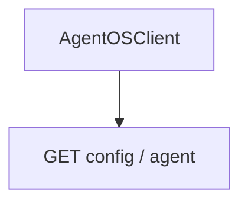

# 01_basic_client.py — 实现原理分析

<!-- cookbook-py-source:start -->
## 完整源码

```python
"""
Basic AgentOSClient Example

This example demonstrates how to use AgentOSClient to connect to
a remote AgentOS instance and perform basic operations.

Prerequisites:
1. Start an AgentOS server:
   python -c "
   from agno.agent import Agent
   from agno.models.openai import OpenAIChat
   from agno.os import AgentOS

   agent = Agent(
       name='Assistant',
       model=OpenAIChat(id='gpt-5.2'),
       instructions='You are a helpful assistant.',
   )
   agent_os = AgentOS(agents=[agent])
   agent_os.serve()
   "

2. Run this script: python 01_basic_client.py
"""

import asyncio

from agno.client import AgentOSClient

# ---------------------------------------------------------------------------
# Create Example
# ---------------------------------------------------------------------------


async def main():
    # Connect to AgentOS using async context manager
    client = AgentOSClient(base_url="http://localhost:7777")
    # Get AgentOS configuration
    config = await client.aget_config()
    print(f"Connected to: {config.name or config.os_id}")
    print(f"Available agents: {[a.id for a in (config.agents or [])]}")
    print(f"Available teams: {[t.id for t in (config.teams or [])]}")
    print(f"Available workflows: {[w.id for w in (config.workflows or [])]}")

    # Get details about a specific agent
    if config.agents:
        agent_id = config.agents[0].id
        agent = await client.aget_agent(agent_id)
        print("\nAgent Details:")
        print(f"  Name: {agent.name}")
        print(f"  Model: {agent.model}")
        print(f"  Tools: {len(agent.tools or [])}")


# ---------------------------------------------------------------------------
# Run Example
# ---------------------------------------------------------------------------

if __name__ == "__main__":
    asyncio.run(main())
```

<!-- cookbook-py-source:end -->

> 源文件：`cookbook/05_agent_os/client/01_basic_client.py`

## 概述

演示 **`AgentOSClient`**：`base_url="http://localhost:7777"`，**`aget_config()`** 拉取 OS 配置并打印 agents/teams/workflows；**`aget_agent(agent_id)`** 取单个 Agent 元数据。**无本地 Agent 定义**，纯客户端。

**核心配置一览：**

| 配置项 | 值 | 说明 |
|--------|------|------|
| `AgentOSClient` | `base_url` | 远端 OS |
| 方法 | `aget_config`, `aget_agent` | 异步 HTTP |

## System Prompt 组装

本脚本**无** LLM；无 system。

## 完整 API 请求

客户端对 **AgentOS REST** 发请求（非 OpenAI）；具体路径见 `agno/client`。

## Mermaid 流程图



## 关键源码文件索引

| 文件 | 作用 |
|------|------|
| `agno/client` | `AgentOSClient` |
