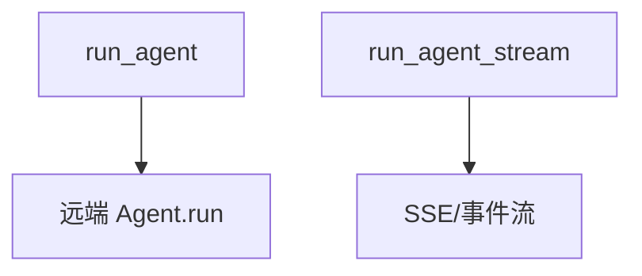

# 02_run_agents.py — 实现原理分析

<!-- cookbook-py-source:start -->
## 完整源码

```python
"""
Running Agents with AgentOSClient

This example demonstrates how to execute agent runs using
AgentOSClient, including both streaming and non-streaming responses.

Prerequisites:
1. Start an AgentOS server with an agent
2. Run this script: python 02_run_agents.py
"""

import asyncio

from agno.client import AgentOSClient

# ---------------------------------------------------------------------------
# Create Example
# ---------------------------------------------------------------------------


async def run_agent_non_streaming():
    """Execute a non-streaming agent run."""
    print("=" * 60)
    print("Non-Streaming Agent Run")
    print("=" * 60)

    client = AgentOSClient(base_url="http://localhost:7777")
    # Get available agents
    config = await client.aget_config()
    if not config.agents:
        print("No agents available")
        return

    agent_id = config.agents[0].id
    print(f"Running agent: {agent_id}")

    # Execute the agent
    result = await client.run_agent(
        agent_id=agent_id,
        message="What is 2 + 2? Explain your answer briefly.",
    )

    print(f"\nRun ID: {result.run_id}")
    print(f"Content: {result.content}")
    print(f"Tokens: {result.metrics.total_tokens if result.metrics else 'N/A'}")


async def run_agent_streaming():
    """Execute a streaming agent run."""
    print("\n" + "=" * 60)
    print("Streaming Agent Run")
    print("=" * 60)

    client = AgentOSClient(base_url="http://localhost:7777")

    # Get available agents
    config = await client.aget_config()
    if not config.agents:
        print("No agents available")
        return

    agent_id = config.agents[0].id
    print(f"Streaming from agent: {agent_id}")
    print("\nResponse: ", end="", flush=True)

    from agno.run.agent import RunCompletedEvent, RunContentEvent

    full_content = ""
    async for event in client.run_agent_stream(
        agent_id=agent_id,
        message="Tell me a short joke.",
    ):
        # Handle different event types
        if isinstance(event, RunContentEvent):
            print(event.content, end="", flush=True)
            full_content += event.content
        elif isinstance(event, RunCompletedEvent):
            # Run completed - could access event.run_id here if needed
            pass

    print("\n")


async def main():
    await run_agent_non_streaming()
    await run_agent_streaming()


# ---------------------------------------------------------------------------
# Run Example
# ---------------------------------------------------------------------------

if __name__ == "__main__":
    asyncio.run(main())
```

<!-- cookbook-py-source:end -->

> 源文件：`cookbook/05_agent_os/client/02_run_agents.py`

## 概述

**`run_agent`** 非流式与 **`run_agent_stream`** 流式：使用配置中第一个 agent；处理 **`RunContentEvent` / `RunCompletedEvent`**。

## System Prompt 组装

无；客户端不拼装 system。

## 完整 API 请求

客户端 → **`POST .../agents/{id}/runs`**（表单或 JSON，以 client 实现为准）；服务端 Agent 再调模型。

## Mermaid 流程图



## 关键源码文件索引

| 文件 | 作用 |
|------|------|
| `agno/client` | `run_agent`, `run_agent_stream` |
