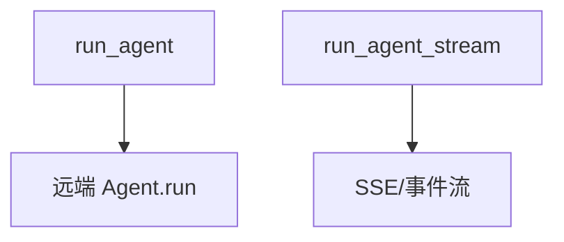

# 02_run_agents.py — 实现原理分析

> 源文件：`cookbook/05_agent_os/client/02_run_agents.py`

## 概述

**`run_agent`** 非流式与 **`run_agent_stream`** 流式：使用配置中第一个 agent；处理 **`RunContentEvent` / `RunCompletedEvent`**。

## System Prompt 组装

无；客户端不拼装 system。

## 完整 API 请求

客户端 → **`POST .../agents/{id}/runs`**（表单或 JSON，以 client 实现为准）；服务端 Agent 再调模型。

## Mermaid 流程图

## 关键源码文件索引

| 文件 | 作用 |
|------|------|
| `agno/client` | `run_agent`, `run_agent_stream` |
