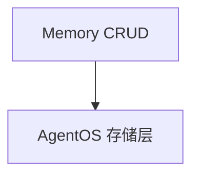

# 03_memory_operations.py — 实现原理分析

> 源文件：`cookbook/05_agent_os/client/03_memory_operations.py`

## 概述

演示 **`create_memory` / `list_memories` / `get_memory` / `update_memory` / `delete_memory`** 及可选 **`get_memory_topics` / `get_user_memory_stats`**（失败则跳过）。

## System Prompt 组装

无 LLM。

## 完整 API 请求

AgentOS **memory HTTP API**。

## Mermaid 流程图

## 关键源码文件索引

| 文件 | 作用 |
|------|------|
| `agno/client` | memory 方法 |
