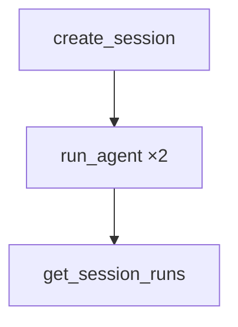

# 04_session_management.py — 实现原理分析

> 源文件：`cookbook/05_agent_os/client/04_session_management.py`

## 概述

**会话生命周期**：`create_session` → `get_sessions` → `get_session` → 同会话多次 `run_agent` → `get_session_runs` → `rename_session` → `delete_session`。

## System Prompt 组装

无。

## 完整 API 请求

Session 与 Runs 的 REST 封装。

## Mermaid 流程图

## 关键源码文件索引

| 文件 | 作用 |
|------|------|
| `agno/client` | session API |
