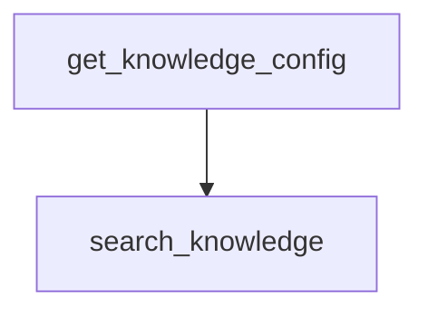

# 05_knowledge_search.py — 实现原理分析

> 源文件：`cookbook/05_agent_os/client/05_knowledge_search.py`

## 概述

**`get_knowledge_config` → `list_knowledge_content` → `search_knowledge`**；若未配置 knowledge 则早退。

## System Prompt 组装

无。

## 完整 API 请求

Knowledge 搜索 HTTP；向量检索在服务端执行。

## Mermaid 流程图

## 关键源码文件索引

| 文件 | 作用 |
|------|------|
| `agno/client` | knowledge API |
