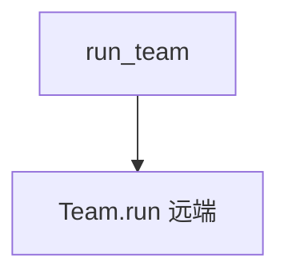

# 06_run_teams.py — 实现原理分析

> 源文件：`cookbook/05_agent_os/client/06_run_teams.py`

## 概述

**`run_team`** 与 **`run_team_stream`**；事件类型 **`agno.run.team` 的 `RunContentEvent` / `RunCompletedEvent`**。

## System Prompt 组装

无（客户端）。

## 完整 API 请求

`POST .../teams/{id}/runs` 及流式变体。

## Mermaid 流程图

## 关键源码文件索引

| 文件 | 作用 |
|------|------|
| `agno/client` | `run_team`, `run_team_stream` |
