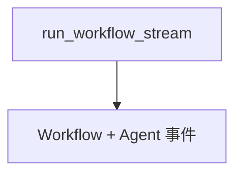

# 07_run_workflows.py — 实现原理分析

> 源文件：`cookbook/05_agent_os/client/07_run_workflows.py`

## 概述

**`run_workflow`** 与 **`run_workflow_stream`**；流式分支根据 **`event.event`** 处理 **`RunContent`** / **`WorkflowAgentCompleted`**。

## System Prompt 组装

无。

## 完整 API 请求

Workflow runs 端点；嵌套 Agent 事件可能混入流。

## Mermaid 流程图

## 关键源码文件索引

| 文件 | 作用 |
|------|------|
| `agno/client` | workflow run |
