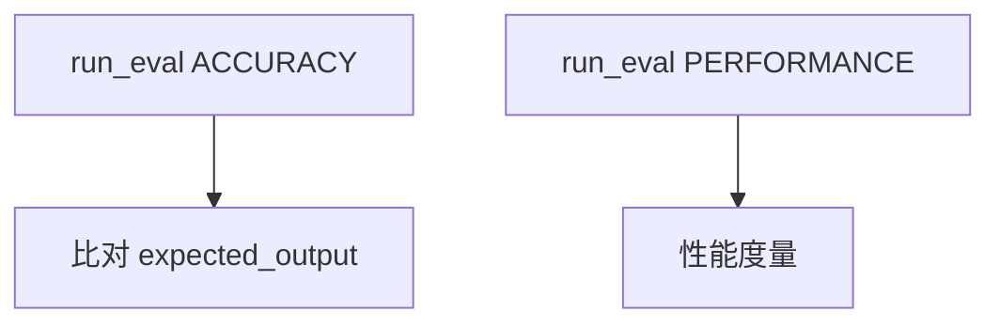

# 08_run_evals.py — 实现原理分析

> 源文件：`cookbook/05_agent_os/client/08_run_evals.py`

## 概述

**`run_eval`**：`EvalType.ACCURACY` 与 **`PERFORMANCE`**；**`list_eval_runs`**、**`get_eval_run`**。

## System Prompt 组装

无。

## 完整 API 请求

Eval 服务端点；内部会驱动 Agent 多轮若 `num_iterations>1`。

## Mermaid 流程图

## 关键源码文件索引

| 文件 | 作用 |
|------|------|
| `agno/db/schemas/evals.py` | `EvalType` |
