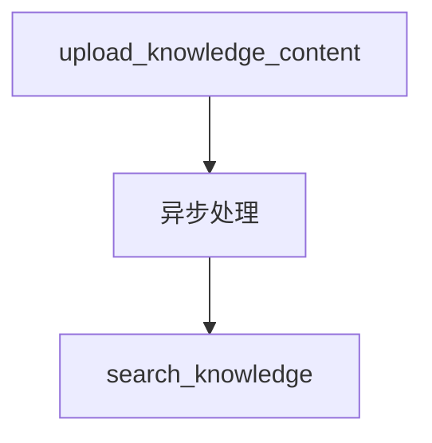

# 09_upload_content.py — 实现原理分析

> 源文件：`cookbook/05_agent_os/client/09_upload_content.py`

## 概述

**`upload_knowledge_content(text_content=...)`**、**`list_knowledge_content`**、**`search_knowledge`**；**`delete_content`** 使用 **`list_content`**（与 list_knowledge_content 不同 API）。上传后 **`get_content_status`** 轮询处理状态。

## System Prompt 组装

无。

## 完整 API 请求

Knowledge 管理 REST；嵌入与切块在服务端。

## Mermaid 流程图

## 关键源码文件索引

| 文件 | 作用 |
|------|------|
| `agno/client` | content upload |
