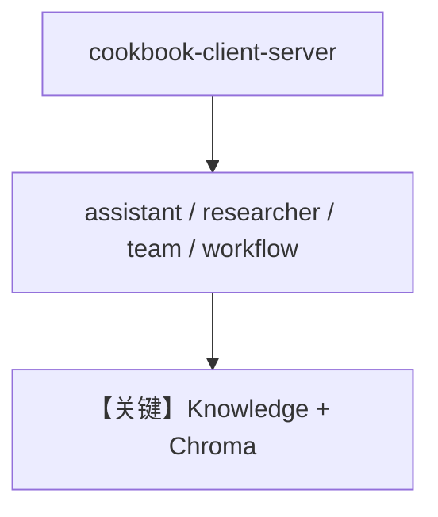

# server.py — 实现原理分析

<!-- cookbook-py-source:start -->
## 完整源码

```python
"""
AgentOS Server for Cookbook Client Examples
"""

from agno.agent import Agent
from agno.db.sqlite import SqliteDb
from agno.knowledge.embedder.openai import OpenAIEmbedder
from agno.knowledge.knowledge import Knowledge
from agno.models.openai import OpenAIChat
from agno.os import AgentOS
from agno.team.team import Team
from agno.tools.calculator import CalculatorTools
from agno.tools.websearch import WebSearchTools
from agno.vectordb.chroma import ChromaDb
from agno.workflow.step import Step
from agno.workflow.workflow import Workflow

# ---------------------------------------------------------------------------
# Create Example
# ---------------------------------------------------------------------------

# =============================================================================
# Database Configuration
# =============================================================================

# SQLite database for sessions, memory, and content metadata
db = SqliteDb(db_file="tmp/cookbook_client.db")

# =============================================================================
# Knowledge Base Configuration
# =============================================================================

knowledge = Knowledge(
    vector_db=ChromaDb(
        path="tmp/cookbook_chromadb",
        collection="cookbook_knowledge",
        embedder=OpenAIEmbedder(id="text-embedding-3-small"),
    ),
    contents_db=db,  # Required for content upload/management endpoints
)

# =============================================================================
# Agent Configuration
# =============================================================================

# Agent 1: Assistant with calculator tools and memory
assistant = Agent(
    name="Assistant",
    model=OpenAIChat(id="gpt-5.2"),
    db=db,
    instructions=[
        "You are a helpful AI assistant.",
        "Use the calculator tool for any math operations.",
        "You have access to a knowledge base - search it when asked about documents.",
    ],
    markdown=True,
    update_memory_on_run=True,  # Required for 03_memory_operations
    tools=[CalculatorTools()],
    knowledge=knowledge,
    search_knowledge=True,
)

# Agent 2: Researcher with web search capabilities
researcher = Agent(
    name="Researcher",
    model=OpenAIChat(id="gpt-5.2"),
    db=db,
    instructions=[
        "You are a research assistant.",
        "Search the web for information when needed.",
        "Provide well-researched, accurate responses.",
    ],
    markdown=True,
    tools=[WebSearchTools()],
)

# =============================================================================
# Team Configuration
# =============================================================================

research_team = Team(
    name="Research Team",
    model=OpenAIChat(id="gpt-5.2"),
    members=[assistant, researcher],
    instructions=[
        "You are a research team that coordinates multiple specialists.",
        "Delegate math questions to the Assistant.",
        "Delegate research questions to the Researcher.",
        "Combine insights from team members for comprehensive answers.",
    ],
    markdown=True,
    db=db,
)

# =============================================================================
# Workflow Configuration
# =============================================================================

qa_workflow = Workflow(
    name="QA Workflow",
    description="A simple Q&A workflow that uses the assistant agent",
    db=db,
    steps=[
        Step(
            name="Answer Question",
            agent=assistant,
        ),
    ],
)

# =============================================================================
# AgentOS Configuration
# =============================================================================

agent_os = AgentOS(
    id="cookbook-client-server",
    description="AgentOS server for running cookbook client examples",
    agents=[assistant, researcher],
    teams=[research_team],
    workflows=[qa_workflow],
    knowledge=[knowledge],
)

# FastAPI app instance (for uvicorn)
app = agent_os.get_app()

# =============================================================================
# Main Entry Point
# =============================================================================

# ---------------------------------------------------------------------------
# Run Example
# ---------------------------------------------------------------------------

if __name__ == "__main__":
    agent_os.serve(app="server:app", reload=True)
```

<!-- cookbook-py-source:end -->

> 源文件：`cookbook/05_agent_os/client/server.py`

## 概述

为 **`client/`** 示例提供 **统一 AgentOS 服务端**：**`ChromaDb` + `OpenAIEmbedder` + `Knowledge(contents_db=db)`**；**`assistant`** 带 **`CalculatorTools`**、**`search_knowledge=True`**、**`update_memory_on_run=True`**；**`researcher`** 带 **`WebSearchTools`**；**`research_team`**；**`qa_workflow`** 单步 **`assistant`**。**`AgentOS(knowledge=[knowledge])`** 注册知识库。

**核心配置一览：**

| 配置项 | 值 | 说明 |
|--------|------|------|
| `id` | `"cookbook-client-server"` | OS id |
| `assistant` | `gpt-5.2`，计算器+知识 | client 03/05 依赖 |
| `knowledge` | Chroma + Sqlite contents | 上传元数据 |

## System Prompt 组装

**assistant** 三条 instructions（见源 `L51-55`）+ markdown + 工具与知识段。

### 还原（核心）

```text
You are a helpful AI assistant.
Use the calculator tool for any math operations.
You have access to a knowledge base - search it when asked about documents.
```

## 完整 API 请求

`OpenAIChat` Chat Completions；带 tools 与可选 retrieval。

## Mermaid 流程图



## 关键源码文件索引

| 文件 | 作用 |
|------|------|
| `agno/os` | `AgentOS`，`knowledge=` 参数 |
