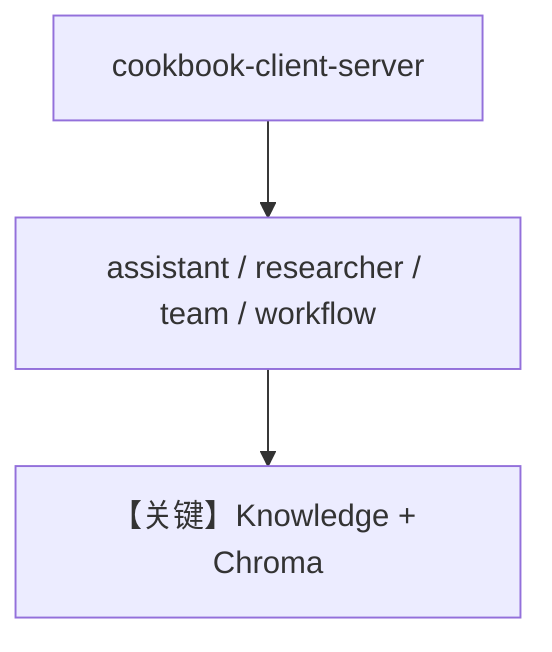

# server.py — 实现原理分析

> 源文件：`cookbook/05_agent_os/client/server.py`

## 概述

为 **`client/`** 示例提供 **统一 AgentOS 服务端**：**`ChromaDb` + `OpenAIEmbedder` + `Knowledge(contents_db=db)`**；**`assistant`** 带 **`CalculatorTools`**、**`search_knowledge=True`**、**`update_memory_on_run=True`**；**`researcher`** 带 **`WebSearchTools`**；**`research_team`**；**`qa_workflow`** 单步 **`assistant`**。**`AgentOS(knowledge=[knowledge])`** 注册知识库。

**核心配置一览：**

| 配置项 | 值 | 说明 |
|--------|------|------|
| `id` | `"cookbook-client-server"` | OS id |
| `assistant` | `gpt-5.2`，计算器+知识 | client 03/05 依赖 |
| `knowledge` | Chroma + Sqlite contents | 上传元数据 |

## System Prompt 组装

**assistant** 三条 instructions（见源 `L51-55`）+ markdown + 工具与知识段。

### 还原（核心）

```text
You are a helpful AI assistant.
Use the calculator tool for any math operations.
You have access to a knowledge base - search it when asked about documents.
```

## 完整 API 请求

`OpenAIChat` Chat Completions；带 tools 与可选 retrieval。

## Mermaid 流程图



## 关键源码文件索引

| 文件 | 作用 |
|------|------|
| `agno/os` | `AgentOS`，`knowledge=` 参数 |
