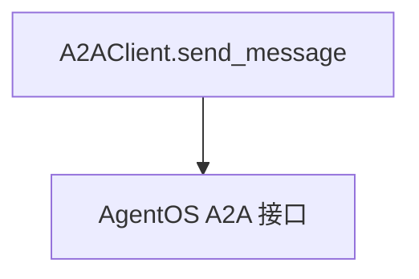

# 01_basic_messaging.py — 实现原理分析

> 源文件：`cookbook/05_agent_os/client_a2a/01_basic_messaging.py`

## 概述

**`A2AClient("http://localhost:7003/a2a/agents/basic-agent")`**：**`send_message(message, user_id)`**，打印 **`task_id` / `context_id` / `status` / `content`**。

## System Prompt 组装

无；A2A 客户端不拼装 prompt。

## 完整 API 请求

对 **`/a2a/agents/...`** 的 A2A 协议 HTTP 调用；服务端 `agno_server` 内 Agent 再调 OpenAI。

## Mermaid 流程图

## 关键源码文件索引

| 文件 | 作用 |
|------|------|
| `agno/client/a2a` | `A2AClient` |
