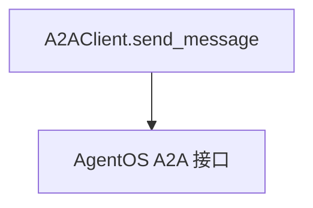

# 01_basic_messaging.py — 实现原理分析

<!-- cookbook-py-source:start -->
## 完整源码

```python
"""
Basic A2A Messaging with A2AClient

This example demonstrates simple message sending with user identification
using the A2A protocol.

Prerequisites:
1. Start an AgentOS server with A2A interface:
   python cookbook/06_agent_os/client_a2a/servers/agno_server.py

2. Run this script:
   python cookbook/06_agent_os/client_a2a/01_basic_messaging.py
"""

import asyncio

from agno.client.a2a import A2AClient

# ---------------------------------------------------------------------------
# Create Example
# ---------------------------------------------------------------------------


async def main():
    """Send message with user identification."""
    print("=" * 60)
    print("A2A Messaging with User ID")
    print("=" * 60)

    client = A2AClient("http://localhost:7003/a2a/agents/basic-agent")
    result = await client.send_message(
        message="Remember my name is Alice.",
        user_id="alice-123",
    )

    print(f"\nTask ID: {result.task_id}")
    print(f"Context ID: {result.context_id}")
    print(f"Status: {result.status}")
    print(f"\nResponse: {result.content}")

    if result.is_completed:
        print("\nTask completed successfully!")
    elif result.is_failed:
        print("\nTask failed!")


# ---------------------------------------------------------------------------
# Run Example
# ---------------------------------------------------------------------------

if __name__ == "__main__":
    asyncio.run(main())
```

<!-- cookbook-py-source:end -->

> 源文件：`cookbook/05_agent_os/client_a2a/01_basic_messaging.py`

## 概述

**`A2AClient("http://localhost:7003/a2a/agents/basic-agent")`**：**`send_message(message, user_id)`**，打印 **`task_id` / `context_id` / `status` / `content`**。

## System Prompt 组装

无；A2A 客户端不拼装 prompt。

## 完整 API 请求

对 **`/a2a/agents/...`** 的 A2A 协议 HTTP 调用；服务端 `agno_server` 内 Agent 再调 OpenAI。

## Mermaid 流程图



## 关键源码文件索引

| 文件 | 作用 |
|------|------|
| `agno/client/a2a` | `A2AClient` |
