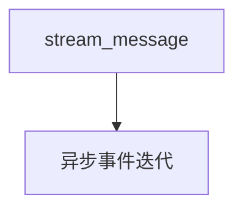

# 02_streaming.py — 实现原理分析

> 源文件：`cookbook/05_agent_os/client_a2a/02_streaming.py`

## 概述

**`stream_message`**：逐事件打印 **`event.content`**；第二例在 **`event.is_final`** 时拼接全文。

## System Prompt 组装

无。

## 完整 API 请求

A2A 流式端点；底层模型流式由服务端处理。

## Mermaid 流程图

## 关键源码文件索引

| 文件 | 作用 |
|------|------|
| `agno/client/a2a` | `stream_message` |
