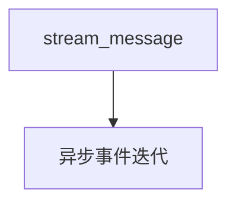

# 02_streaming.py — 实现原理分析

<!-- cookbook-py-source:start -->
## 完整源码

```python
"""
Streaming A2A Messages with A2AClient

This example demonstrates real-time streaming responses
using the A2A protocol.

Prerequisites:
1. Start an AgentOS server with A2A interface:
   python cookbook/06_agent_os/client_a2a/servers/agno_server.py

2. Run this script:
   python cookbook/06_agent_os/client_a2a/02_streaming.py
"""

import asyncio

from agno.client.a2a import A2AClient

# ---------------------------------------------------------------------------
# Create Example
# ---------------------------------------------------------------------------


async def basic_streaming():
    """Stream a response from an A2A agent."""
    print("=" * 60)
    print("Streaming A2A Response")
    print("=" * 60)

    client = A2AClient("http://localhost:7003/a2a/agents/basic-agent")
    print("\nStreaming response from agent...")
    print("\nResponse: ", end="", flush=True)

    async for event in client.stream_message(
        message="Tell me a short joke.",
    ):
        # Print content as it arrives
        if event.is_content and event.content:
            print(event.content, end="", flush=True)


async def streaming_with_events():
    """Stream with detailed event tracking."""
    print("\n" + "=" * 60)
    print("Streaming with Event Details")
    print("=" * 60)

    client = A2AClient("http://localhost:7003/a2a/agents/basic-agent")
    print("\nEvent log:")

    content_buffer = []

    async for event in client.stream_message(
        message="What is Python?",
    ):
        if event.content:
            content_buffer.append(event.content)

        if event.is_final:
            print("\nFull response:")
            print("".join(content_buffer))


async def main():
    await basic_streaming()
    await streaming_with_events()


# ---------------------------------------------------------------------------
# Run Example
# ---------------------------------------------------------------------------

if __name__ == "__main__":
    asyncio.run(main())
```

<!-- cookbook-py-source:end -->

> 源文件：`cookbook/05_agent_os/client_a2a/02_streaming.py`

## 概述

**`stream_message`**：逐事件打印 **`event.content`**；第二例在 **`event.is_final`** 时拼接全文。

## System Prompt 组装

无。

## 完整 API 请求

A2A 流式端点；底层模型流式由服务端处理。

## Mermaid 流程图



## 关键源码文件索引

| 文件 | 作用 |
|------|------|
| `agno/client/a2a` | `stream_message` |
