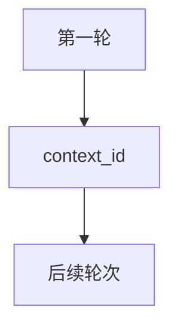

# 03_multi_turn.py — 实现原理分析

<!-- cookbook-py-source:start -->
## 完整源码

```python
"""
Multi-Turn Conversations with A2AClient

This example demonstrates how to maintain conversation context
across multiple messages using the A2A protocol.

Prerequisites:
1. Start an AgentOS server with A2A interface:
   python cookbook/06_agent_os/client_a2a/servers/agno_server.py

2. Run this script:
   python cookbook/06_agent_os/client_a2a/03_multi_turn.py
"""

import asyncio

from agno.client.a2a import A2AClient

# ---------------------------------------------------------------------------
# Create Example
# ---------------------------------------------------------------------------


async def multi_turn_conversation():
    """Demonstrate multi-turn conversation with context retention."""
    print("=" * 60)
    print("Multi-Turn A2A Conversation")
    print("=" * 60)

    client = A2AClient("http://localhost:7003/a2a/agents/basic-agent")

    # First message - introduce ourselves
    print("\nUser: My name is Alice and I love Python programming.")
    result1 = await client.send_message(
        message="My name is Alice and I love Python programming.",
    )
    print(f"Agent: {result1.content}")

    # Get the context_id for follow-up messages
    context_id = result1.context_id
    print(f"\n[Using context_id: {context_id}]")

    # Second message - ask about previous context
    print("\nUser: What is my name?")
    result2 = await client.send_message(
        message="What is my name?",
        context_id=context_id,  # Pass the context_id
    )
    print(f"Agent: {result2.content}")

    # Third message - continue the conversation
    print("\nUser: What do I love?")
    result3 = await client.send_message(
        message="What do I love?",
        context_id=context_id,
    )
    print(f"Agent: {result3.content}")


async def streaming_multi_turn():
    """Multi-turn conversation with streaming responses."""
    print("\n" + "=" * 60)
    print("Streaming Multi-Turn Conversation")
    print("=" * 60)

    client = A2AClient("http://localhost:7003/a2a/agents/basic-agent")
    context_id = None

    questions = [
        "I'm planning a trip to Japan.",
        "What's the best time to visit?",
        "Any must-see places?",
    ]

    for question in questions:
        print(f"\nUser: {question}")
        print("Agent: ", end="", flush=True)

        async for event in client.stream_message(
            message=question,
            context_id=context_id,
        ):
            if event.is_content and event.content:
                print(event.content, end="", flush=True)

            # Capture context_id from first response
            if event.context_id and not context_id:
                context_id = event.context_id

        print()  # Newline after each response


async def main():
    await multi_turn_conversation()
    await streaming_multi_turn()


# ---------------------------------------------------------------------------
# Run Example
# ---------------------------------------------------------------------------

if __name__ == "__main__":
    asyncio.run(main())
```

<!-- cookbook-py-source:end -->

> 源文件：`cookbook/05_agent_os/client_a2a/03_multi_turn.py`

## 概述

**多轮上下文**：首轮后携带 **`context_id`** 调用后续 **`send_message` / `stream_message`**；流式示例在首包捕获 **`context_id`**。

## 运行机制与因果链

`context_id` 绑定服务端会话/任务状态，使 Agent 能引用前文。

## System Prompt 组装

无。

## 完整 API 请求

同 A2A；`context_id` 作为参数传递。

## Mermaid 流程图



## 关键源码文件索引

| 文件 | 作用 |
|------|------|
| `agno/client/a2a` | `context_id` 参数 |
