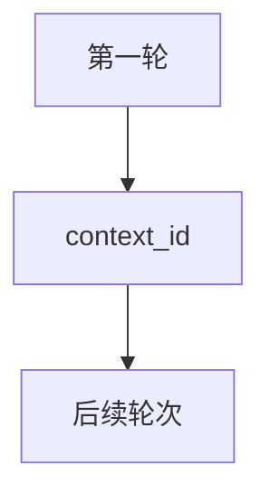

# 03_multi_turn.py — 实现原理分析

> 源文件：`cookbook/05_agent_os/client_a2a/03_multi_turn.py`

## 概述

**多轮上下文**：首轮后携带 **`context_id`** 调用后续 **`send_message` / `stream_message`**；流式示例在首包捕获 **`context_id`**。

## 运行机制与因果链

`context_id` 绑定服务端会话/任务状态，使 Agent 能引用前文。

## System Prompt 组装

无。

## 完整 API 请求

同 A2A；`context_id` 作为参数传递。

## Mermaid 流程图

## 关键源码文件索引

| 文件 | 作用 |
|------|------|
| `agno/client/a2a` | `context_id` 参数 |
