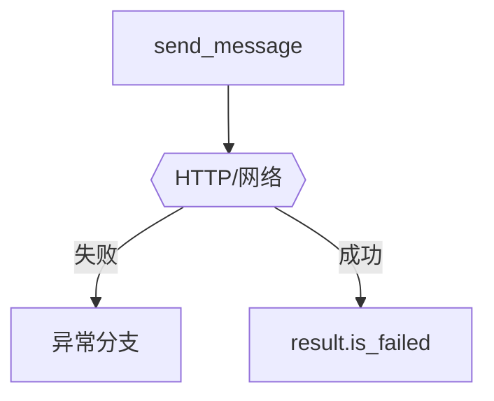

# 04_error_handling.py — 实现原理分析

> 源文件：`cookbook/05_agent_os/client_a2a/04_error_handling.py`

## 概述

演示 **`HTTPStatusError`**（404 agent）、**`RemoteServerUnavailableError`**（连接失败/超时）、**`timeout=0.001`** 极端超时；**`safe_send_message`** 统一处理并检查 **`result.is_failed`**。

## System Prompt 组装

无。

## 完整 API 请求

失败时为 httpx 层；成功时同 A2A。

## Mermaid 流程图

## 关键源码文件索引

| 文件 | 作用 |
|------|------|
| `agno/exceptions` | `RemoteServerUnavailableError` |
