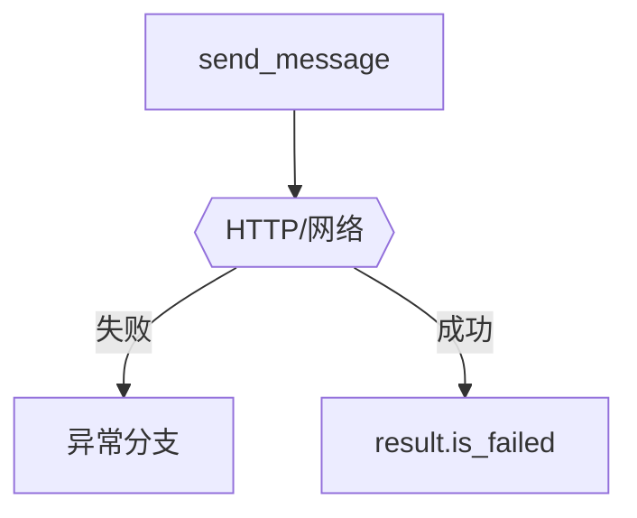

# 04_error_handling.py — 实现原理分析

<!-- cookbook-py-source:start -->
## 完整源码

```python
"""
Error Handling with A2AClient

This example demonstrates how to handle various error scenarios
when using the A2A protocol.

Prerequisites:
1. Start an AgentOS server with A2A interface:
   python cookbook/06_agent_os/client_a2a/servers/agno_server.py

2. Run this script:
   python cookbook/06_agent_os/client_a2a/04_error_handling.py
"""

import asyncio

from agno.client.a2a import A2AClient
from agno.exceptions import RemoteServerUnavailableError
from httpx import HTTPStatusError

# ---------------------------------------------------------------------------
# Create Example
# ---------------------------------------------------------------------------


async def handle_http_error():
    """Handle case when agent doesn't exist (404)."""
    print("=" * 60)
    print("Handling HTTP Errors (e.g., Agent Not Found)")
    print("=" * 60)

    client = A2AClient("http://localhost:7003/a2a/agents/nonexistent-agent")
    try:
        await client.send_message(
            message="Hello",
        )
    except HTTPStatusError as e:
        print(f"\nHTTP Error: {e.response.status_code}")
        print(f"Detail: {e.response.text[:100]}...")
        print("Suggestion: Check if the agent exists on the server")


async def handle_connection_error():
    """Handle case when server is unreachable."""
    print("\n" + "=" * 60)
    print("Handling Connection Error")
    print("=" * 60)

    # Try to connect to a server that doesn't exist
    client = A2AClient("http://localhost:9999/a2a/agents/any-agent")
    try:
        await client.send_message(
            message="Hello",
        )
    except RemoteServerUnavailableError as e:
        print(f"\nConnection failed: {e.message}")
        print(f"Server URL: {e.base_url}")
        print("Suggestion: Check if the A2A server is running")


async def handle_timeout():
    """Handle request timeout."""
    print("\n" + "=" * 60)
    print("Handling Timeout")
    print("=" * 60)

    # Use a very short timeout
    client = A2AClient("http://localhost:7003/a2a/agents/basic-agent", timeout=0.001)
    try:
        await client.send_message(
            message="This might timeout",
        )
    except RemoteServerUnavailableError as e:
        print(f"\nRequest failed: {e.message}")
        print("Suggestion: Increase timeout or check server performance")


async def comprehensive_error_handling():
    """Demonstrate comprehensive error handling pattern."""
    print("\n" + "=" * 60)
    print("Comprehensive Error Handling Pattern")
    print("=" * 60)

    async def safe_send_message(client, message: str):
        """Safely send a message with proper error handling."""
        try:
            result = await client.send_message(
                message=message,
            )

            # Check if the task failed at the application level
            if result.is_failed:
                print(f"Error: Task failed - {result.content}")
                return None

            return result

        except HTTPStatusError as e:
            print(f"Error: HTTP {e.response.status_code}")
            return None

        except RemoteServerUnavailableError as e:
            print(f"Error: Server unavailable - {e.message}")
            return None

    client = A2AClient("http://localhost:7003/a2a/agents/basic-agent")

    print("\nTrying valid agent...")
    result = await safe_send_message(client, "Hello!")
    if result:
        print(f"Success: {result.content[:50]}...")

    client = A2AClient("http://localhost:7003/a2a/agents/invalid-agent")
    print("\nTrying invalid agent...")
    result = await safe_send_message(client, "Hello!")
    if result:
        print(f"Success: {result.content}")


async def main():
    await handle_http_error()
    await handle_connection_error()
    await handle_timeout()
    await comprehensive_error_handling()


# ---------------------------------------------------------------------------
# Run Example
# ---------------------------------------------------------------------------

if __name__ == "__main__":
    asyncio.run(main())
```

<!-- cookbook-py-source:end -->

> 源文件：`cookbook/05_agent_os/client_a2a/04_error_handling.py`

## 概述

演示 **`HTTPStatusError`**（404 agent）、**`RemoteServerUnavailableError`**（连接失败/超时）、**`timeout=0.001`** 极端超时；**`safe_send_message`** 统一处理并检查 **`result.is_failed`**。

## System Prompt 组装

无。

## 完整 API 请求

失败时为 httpx 层；成功时同 A2A。

## Mermaid 流程图



## 关键源码文件索引

| 文件 | 作用 |
|------|------|
| `agno/exceptions` | `RemoteServerUnavailableError` |
