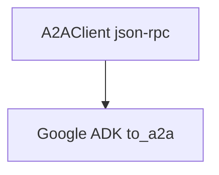

# 05_connect_to_google_adk.py — 实现原理分析

> 源文件：`cookbook/05_agent_os/client_a2a/05_connect_to_google_adk.py`

## 概述

**跨栈 A2A**：**`A2AClient(ADK_SERVER_URL, protocol="json-rpc")`** 连接 **Google ADK** 暴露的服务（**`google_adk_server.py`**），**非 Agno AgentOS**。可选 **`get_agent_card()`**。

## System Prompt 组装

无（客户端）；ADK 侧 Agent 由 Google 库定义。

## 完整 API 请求

JSON-RPC 到 `localhost:8001`；模型为 **Gemini**（见 server 文件）。

## Mermaid 流程图

## 关键源码文件索引

| 文件 | 作用 |
|------|------|
| `agno/client/a2a` | `protocol="json-rpc"` |
