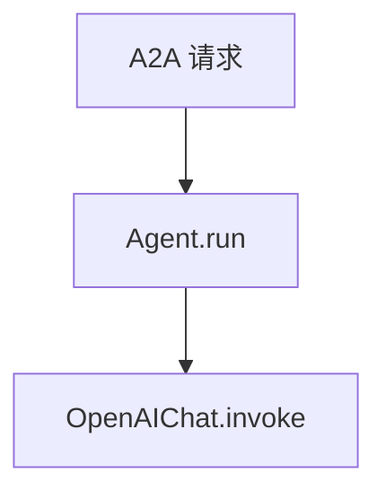

# agno_server.py — 实现原理分析

> 源文件：`cookbook/05_agent_os/client_a2a/servers/agno_server.py`

## 概述

**测试用 AgentOS A2A 服务**：**`chat_agent`** **`id="basic-agent"`**，**`OpenAIChat(gpt-5.2)`**，**`description` + `instructions`**，**`a2a_interface=True`**，端口 **7003**。

**核心配置一览：**

| 配置项 | 值 | 说明 |
|--------|------|------|
| `description` | 长句 assistant 描述 | `# 3.3.1` |
| `instructions` | `"You are a helpful AI assistant."` | `# 3.3.3` |
| `add_datetime_to_context` | True | 时间 |
| `add_history_to_context` | True | 历史 |
| `markdown` | True | markdown |

## System Prompt 组装

### 还原后的完整 System 文本

```text
A helpful AI assistant that provides thoughtful answers...
```
（`description` 全文见源 L30）

```text
You are a helpful AI assistant.

```

```text
Use markdown to format your answers.

```

```text
The current time is <运行时>.
```

## 完整 API 请求

`OpenAIChat` → `chat.completions.create`。

## Mermaid 流程图



## 关键源码文件索引

| 文件 | 作用 |
|------|------|
| `agno/os` | `a2a_interface=True` |
