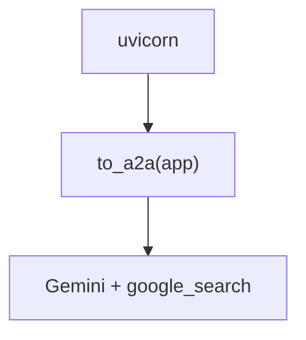

# google_adk_server.py — 实现原理分析

<!-- cookbook-py-source:start -->
## 完整源码

````python
"""Google ADK A2A Server for testing A2AClient.

This server uses Google's Agent Development Kit (ADK) to create an A2A-compatible
agent that can be tested with Agno's A2AClient.

Note: To enable streaming, you need to set the `streaming` capability to `true` in the agent card. This means creating a custom agent card and providing it to the `to_a2a` function.

For example:
```python
agent_card = AgentCard(
    name="facts_agent",
    description="Agent that provides interesting facts.",
    url="http://localhost:8001",
    version="1.0.0",
    capabilities=AgentCapabilities(streaming=True, push_notifications=False, state_transition_history=False),
    skills=[],
    default_input_modes=["text/plain"],
    default_output_modes=["text/plain"],
)
```

Prerequisites:
    uv pip install google-adk a2a-sdk uvicorn
    export GOOGLE_API_KEY=your_key

Usage:
    python cookbook/06_agent_os/client_a2a/servers/google_adk_server.py

The server will start at http://localhost:8001
"""

import os

from google.adk import Agent
from google.adk.a2a.utils.agent_to_a2a import to_a2a
from google.adk.tools import google_search

# ---------------------------------------------------------------------------
# Create Example
# ---------------------------------------------------------------------------

agent = Agent(
    name="facts_agent",
    model="gemini-2.5-flash-lite",
    description="Agent that provides interesting facts using Google Search.",
    instruction="You are a helpful agent who can provide interesting facts. "
    "Use Google Search to find accurate and up-to-date information when needed.",
    tools=[google_search],
)

app = to_a2a(agent, port=int(os.getenv("PORT", "8001")))

# ---------------------------------------------------------------------------
# Run Example
# ---------------------------------------------------------------------------

if __name__ == "__main__":
    import uvicorn

    print("Server URL: http://localhost:8001")
    uvicorn.run(app, host="localhost", port=8001)
````

<!-- cookbook-py-source:end -->

> 源文件：`cookbook/05_agent_os/client_a2a/servers/google_adk_server.py`

## 概述

**非 Agno**：使用 **`google.adk.Agent`** + **`to_a2a`** 生成 ASGI 应用，**`uvicorn.run`**。**`gemini-2.5-flash-lite`** + **`google_search`** 工具。

## System Prompt 组装

ADK Agent 的 **`instruction`** 字面量：

```text
You are a helpful agent who can provide interesting facts. Use Google Search to find accurate and up-to-date information when needed.
```

## 完整 API 请求

Google Gemini API（经 ADK）；非 OpenAI。

## Mermaid 流程图



## 关键源码文件索引

| 文件 | 作用 |
|------|------|
| `google.adk.a2a` | `to_a2a` |
