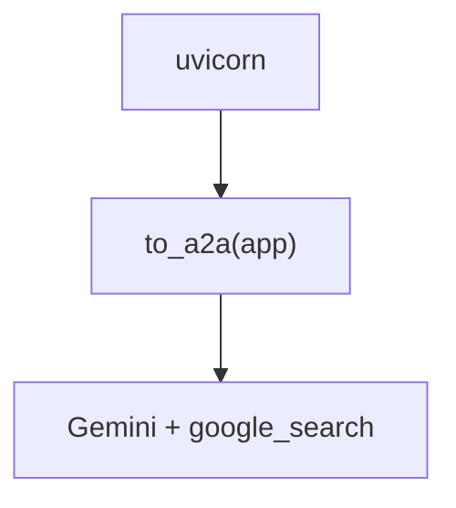

# google_adk_server.py — 实现原理分析

> 源文件：`cookbook/05_agent_os/client_a2a/servers/google_adk_server.py`

## 概述

**非 Agno**：使用 **`google.adk.Agent`** + **`to_a2a`** 生成 ASGI 应用，**`uvicorn.run`**。**`gemini-2.5-flash-lite`** + **`google_search`** 工具。

## System Prompt 组装

ADK Agent 的 **`instruction`** 字面量：

```text
You are a helpful agent who can provide interesting facts. Use Google Search to find accurate and up-to-date information when needed.
```

## 完整 API 请求

Google Gemini API（经 ADK）；非 OpenAI。

## Mermaid 流程图



## 关键源码文件索引

| 文件 | 作用 |
|------|------|
| `google.adk.a2a` | `to_a2a` |
