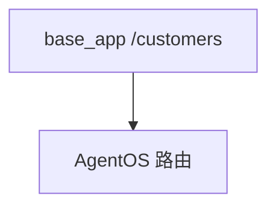

# custom_fastapi_app.py — 实现原理分析

> 源文件：`cookbook/05_agent_os/customize/custom_fastapi_app.py`

## 概述

**`base_app=app`**：先建 **`FastAPI`** 自定义路由 **`/customers`**，再 **`AgentOS(..., base_app=app)`** **`get_app()`** 合并 AgentOS 路由。**`Claude` + WebSearch**。

## System Prompt 组装

**web_research_agent** 无显式 `instructions`；有 history/datetime/markdown。

## 完整 API 请求

`Claude` → Anthropic Messages API。

## Mermaid 流程图

## 关键源码文件索引

| 文件 | 作用 |
|------|------|
| `agno/os` | `base_app` |
