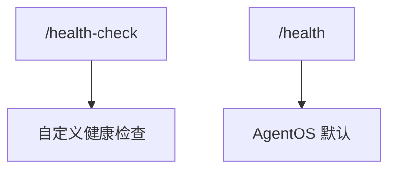

# custom_health_endpoint.py — 实现原理分析

> 源文件：`cookbook/05_agent_os/customize/custom_health_endpoint.py`

## 概述

**`get_health_router(health_endpoint="/health-check")`** 挂到 **`base_app`**，与 AgentOS 默认 **`/health`** 并存（注释说明）。

## System Prompt 组装

同 `custom_fastapi_app` 型 Agent。

## 完整 API 请求

Claude Messages。

## Mermaid 流程图

## 关键源码文件索引

| 文件 | 作用 |
|------|------|
| `agno/os/routers/health.py` | `get_health_router` |
