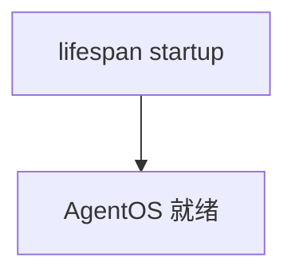

# custom_lifespan.py — 实现原理分析

> 源文件：`cookbook/05_agent_os/customize/custom_lifespan.py`

## 概述

**`AgentOS(lifespan=lifespan)`** 将自定义 **asynccontextmanager** 接入 FastAPI 生命周期；注释 **`reload=True` 与 lifespan 冲突** 故 **`serve` 不用 reload**。

## System Prompt 组装

**example_agent**：仅 `markdown=True`，无 instructions。

## 完整 API 请求

Claude；若 model 未覆盖默认需运行时确认。

## Mermaid 流程图

## 关键源码文件索引

| 文件 | 作用 |
|------|------|
| `agno/os` | `lifespan=` |
