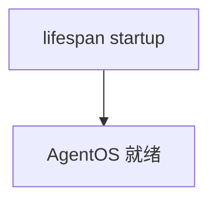

# custom_lifespan.py — 实现原理分析

<!-- cookbook-py-source:start -->
## 完整源码

```python
"""
Example AgentOS app where the agent has a custom lifespan.
"""

from contextlib import asynccontextmanager

from agno.agent import Agent
from agno.db.postgres import PostgresDb
from agno.models.anthropic import Claude
from agno.os import AgentOS
from agno.utils.log import log_info

# ---------------------------------------------------------------------------
# Create Example
# ---------------------------------------------------------------------------

# Setup the database
db = PostgresDb(db_url="postgresql+psycopg://ai:ai@localhost:5532/ai")

# Setup basic agents, teams and workflows
agno_support_agent = Agent(
    id="example-agent",
    name="Example Agent",
    model=Claude(id="claude-sonnet-4-0"),
    db=db,
    markdown=True,
)


@asynccontextmanager
async def lifespan(app):
    log_info("Starting My FastAPI App")
    yield
    log_info("Stopping My FastAPI App")


agent_os = AgentOS(
    description="Example app with custom lifespan",
    agents=[agno_support_agent],
    lifespan=lifespan,
)


app = agent_os.get_app()

# ---------------------------------------------------------------------------
# Run Example
# ---------------------------------------------------------------------------

if __name__ == "__main__":
    """Run your AgentOS.

    You can see test your AgentOS at:
    http://localhost:7777/docs

    """
    # Don't use reload=True here, this can cause issues with the lifespan
    agent_os.serve(app="custom_lifespan:app")
```

<!-- cookbook-py-source:end -->

> 源文件：`cookbook/05_agent_os/customize/custom_lifespan.py`

## 概述

**`AgentOS(lifespan=lifespan)`** 将自定义 **asynccontextmanager** 接入 FastAPI 生命周期；注释 **`reload=True` 与 lifespan 冲突** 故 **`serve` 不用 reload**。

## System Prompt 组装

**example_agent**：仅 `markdown=True`，无 instructions。

## 完整 API 请求

Claude；若 model 未覆盖默认需运行时确认。

## Mermaid 流程图



## 关键源码文件索引

| 文件 | 作用 |
|------|------|
| `agno/os` | `lifespan=` |
