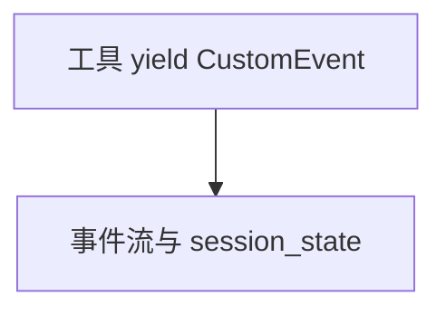

# handle_custom_events.py — 实现原理分析

<!-- cookbook-py-source:start -->
## 完整源码

```python
"""Example for AgentOS to show how to generate custom events.

You can yield custom events from your own tools. These events will be handled internally as an Agno event, and you will be able to access it in the same way you would access any other Agno event.

In this example we also pass the session state to the tool, so that the tool can use it to get the customer profile.
"""

from dataclasses import dataclass
from typing import Optional

from agno.agent import Agent
from agno.db.postgres import PostgresDb
from agno.os import AgentOS
from agno.run import RunContext
from agno.run.agent import CustomEvent
from agno.team import Team

# ---------------------------------------------------------------------------
# Create Example
# ---------------------------------------------------------------------------

# Setup the database
db = PostgresDb(id="basic-db", db_url="postgresql+psycopg://ai:ai@localhost:5532/ai")


# Our custom event, extending the CustomEvent class
@dataclass
class CustomerProfileEvent(CustomEvent):
    """CustomEvent for customer profile."""

    customer_name: Optional[str] = None
    customer_email: Optional[str] = None
    customer_phone: Optional[str] = None


async def get_customer_profile(run_context: RunContext):
    """
    Get customer profiles.
    """
    if run_context.session_state is None:
        raise Exception("Session state is required")

    customer_name = run_context.session_state.get("customer_name", "John Doe")
    customer_email = run_context.session_state.get(
        "customer_email", "john.doe@example.com"
    )
    customer_phone = run_context.session_state.get("customer_phone", "1234567890")

    # We only need to yield the custom event, Agno will handle the rest.
    yield CustomerProfileEvent(
        customer_name=customer_name,
        customer_email=customer_email,
        customer_phone=customer_phone,
    )


# Setup basic agents, teams and workflows
customer_profile_agent = Agent(
    id="customer-profile-agent",
    name="Customer Profile Agent",
    db=db,
    markdown=True,
    instructions="You are a customer profile agent. You are asked to get customer profiles.",
    tools=[get_customer_profile],
    debug_mode=True,
)

customer_team = Team(
    members=[customer_profile_agent],
    id="customer-team",
    name="Customer Team",
    db=db,
    markdown=True,
    instructions="You are a customer team. You are asked to get customer profiles.",
)

# Setup our AgentOS app
agent_os = AgentOS(
    description="Example AgentOS to show how to pass dependencies to an agent",
    agents=[customer_profile_agent],
    teams=[customer_team],
)
app = agent_os.get_app()


# ---------------------------------------------------------------------------
# Run Example
# ---------------------------------------------------------------------------

if __name__ == "__main__":
    """Run your AgentOS.

    To test your custom events that read from session state, you can pass the session state on the request.

    Test getting customer profiles:
    curl --location 'http://localhost:7777/teams/customer-team/runs' \
        --header 'Content-Type: application/x-www-form-urlencoded' \
        --data-urlencode 'message=Find me information about the current customer.' \
        --data-urlencode 'user_id=user_123.' \
        --data-urlencode 'session_state={"customer_name": "John Doe", "customer_email": "john.doe@example.com", "customer_phone": "1234567890"}'

    Or directly to the agent:
    curl --location 'http://localhost:7777/agents/customer-profile-agent/runs' \
        --header 'Content-Type: application/x-www-form-urlencoded' \
        --data-urlencode 'message=Find me information about the current customer.' \
        --data-urlencode 'user_id=user_123.' \
        --data-urlencode 'session_state={"customer_name": "John Doe", "customer_email": "john.doe@example.com", "customer_phone": "1234567890"}'
    """
    agent_os.serve(app="handle_custom_events:app", reload=True)
```

<!-- cookbook-py-source:end -->

> 源文件：`cookbook/05_agent_os/customize/handle_custom_events.py`

## 概述

工具 **`get_customer_profile`** 为 **async generator**，**`yield CustomerProfileEvent`**（**`CustomEvent`** 子类）。**`session_state`** 取客户字段。**`customer_team`** 单成员。**`debug_mode=True`**。

## System Prompt 组装

**customer_profile_agent**：

```text
You are a customer profile agent. You are asked to get customer profiles.

```

**Team**：

```text
You are a customer team. You are asked to get customer profiles.

```

## 完整 API 请求

主模型未显式设置（**`Agent` 无 model**）— 需框架默认或会失败；须核查。

## Mermaid 流程图



## 关键源码文件索引

| 文件 | 作用 |
|------|------|
| `agno/run/agent` | `CustomEvent` |
