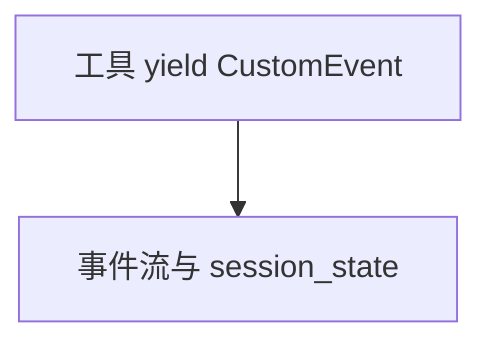

# handle_custom_events.py — 实现原理分析

> 源文件：`cookbook/05_agent_os/customize/handle_custom_events.py`

## 概述

工具 **`get_customer_profile`** 为 **async generator**，**`yield CustomerProfileEvent`**（**`CustomEvent`** 子类）。**`session_state`** 取客户字段。**`customer_team`** 单成员。**`debug_mode=True`**。

## System Prompt 组装

**customer_profile_agent**：

```text
You are a customer profile agent. You are asked to get customer profiles.

```

**Team**：

```text
You are a customer team. You are asked to get customer profiles.

```

## 完整 API 请求

主模型未显式设置（**`Agent` 无 model**）— 需框架默认或会失败；须核查。

## Mermaid 流程图



## 关键源码文件索引

| 文件 | 作用 |
|------|------|
| `agno/run/agent` | `CustomEvent` |
