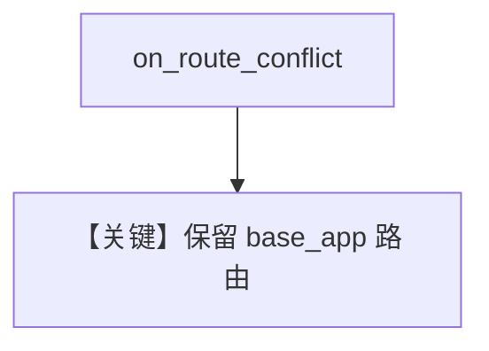

# override_routes.py — 实现原理分析

<!-- cookbook-py-source:start -->
## 完整源码

```python
"""
Example AgentOS app with a custom FastAPI app with conflicting routes.

This example demonstrates the `on_route_conflict="preserve_base_app"` functionality which allows your
custom routes to take precedence over conflicting AgentOS routes.

When `on_route_conflict="preserve_base_app"`:
- Your custom routes (/, /health) will be preserved
- Conflicting AgentOS routes will be skipped
- Non-conflicting AgentOS routes will still be added

When `on_route_conflict="preserve_agentos"` (default):
- AgentOS routes will override your custom routes
- Warnings will be logged about the conflicts
"""

from agno.agent import Agent
from agno.db.postgres import PostgresDb
from agno.models.anthropic import Claude
from agno.os import AgentOS
from agno.tools.websearch import WebSearchTools
from fastapi import FastAPI

# ---------------------------------------------------------------------------
# Create Example
# ---------------------------------------------------------------------------

# Setup the database
db = PostgresDb(db_url="postgresql+psycopg://ai:ai@localhost:5532/ai")

web_research_agent = Agent(
    id="web-research-agent",
    name="Web Research Agent",
    model=Claude(id="claude-sonnet-4-0"),
    db=db,
    tools=[WebSearchTools()],
    add_history_to_context=True,
    num_history_runs=3,
    add_datetime_to_context=True,
    markdown=True,
)

# Custom FastAPI app
app: FastAPI = FastAPI(
    title="Custom FastAPI App",
    version="1.0.0",
)


# Custom landing page (conflicts with AgentOS home route)
@app.get("/")
async def get_custom_home():
    return {
        "message": "Custom FastAPI App",
        "note": 'Using on_route_conflict="preserve_base_app" to preserve custom routes',
    }


# Custom health endpoint (conflicts with AgentOS health route)
@app.get("/health")
async def get_custom_health():
    return {"status": "custom_ok", "note": "This is your custom health endpoint"}


# Setup our AgentOS app by passing your FastAPI app in the app_config parameter
# Use on_route_conflict="preserve_base_app" to preserve your custom routes over AgentOS routes
agent_os = AgentOS(
    description="Example app with route replacement",
    agents=[web_research_agent],
    base_app=app,
    on_route_conflict="preserve_base_app",  # Skip conflicting AgentOS routes, keep your custom routes
)

app = agent_os.get_app()

# ---------------------------------------------------------------------------
# Run Example
# ---------------------------------------------------------------------------

if __name__ == "__main__":
    """Run your AgentOS.

    With on_route_conflict="preserve_base_app":
    - Your custom routes are preserved: http://localhost:7777/ and http://localhost:7777/health
    - AgentOS routes are available at other paths: http://localhost:7777/sessions, etc.
    - Conflicting AgentOS routes (GET / and GET /health) are skipped
    - API docs: http://localhost:7777/docs

    Try changing on_route_conflict="preserve_agentos" to see AgentOS routes override your custom ones. This is the default behavior.
    """
    agent_os.serve(app="override_routes:app", reload=True)
```

<!-- cookbook-py-source:end -->

> 源文件：`cookbook/05_agent_os/customize/override_routes.py`

## 概述

**`on_route_conflict="preserve_base_app"`**：自定义 **`/`** 与 **`/health`** 覆盖 AgentOS 同源路由；冲突时跳过 OS 路由。

## System Prompt 组装

同 web_research_agent 系列（Claude + WebSearch）。

## 完整 API 请求

Claude Messages。

## Mermaid 流程图



## 关键源码文件索引

| 文件 | 作用 |
|------|------|
| `agno/os` | `on_route_conflict` |
