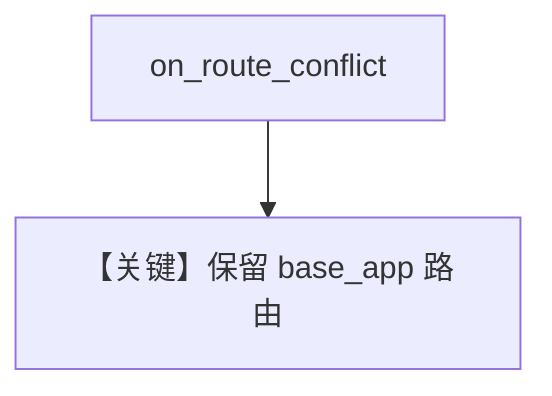

# override_routes.py — 实现原理分析

> 源文件：`cookbook/05_agent_os/customize/override_routes.py`

## 概述

**`on_route_conflict="preserve_base_app"`**：自定义 **`/`** 与 **`/health`** 覆盖 AgentOS 同源路由；冲突时跳过 OS 路由。

## System Prompt 组装

同 web_research_agent 系列（Claude + WebSearch）。

## 完整 API 请求

Claude Messages。

## Mermaid 流程图

## 关键源码文件索引

| 文件 | 作用 |
|------|------|
| `agno/os` | `on_route_conflict` |
