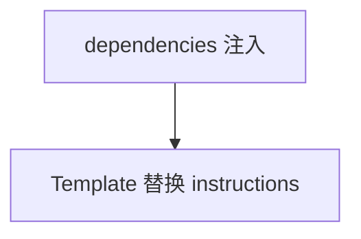

# pass_dependencies_to_agent.py — 实现原理分析

> 源文件：`cookbook/05_agent_os/customize/pass_dependencies_to_agent.py`

## 概述

**`instructions` 含占位符 `{robot_name}`**，通过请求 **`dependencies={"robot_name": "Anna"}`**（curl 注释）由 **`resolve_in_context`** 类机制替换（默认 `resolve_in_context` 需确认是否为 True）。

**核心配置一览：**

| 配置项 | 值 | 说明 |
|--------|------|------|
| `story_writer` | 无 `model` | 依赖默认模型 |

## System Prompt 组装

```text
You are a story writer. You are asked to write a story about a robot. Always name the robot {robot_name}

```

解析后示例：

```text
You are a story writer. You are asked to write a story about a robot. Always name the robot Anna
```

## 完整 API 请求

取决于解析后模型。

## Mermaid 流程图



## 关键源码文件索引

| 文件 | 作用 |
|------|------|
| `agno/agent/_messages.py` | `format_message_with_state_variables` |
