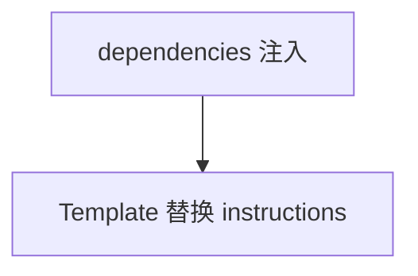

# pass_dependencies_to_agent.py — 实现原理分析

<!-- cookbook-py-source:start -->
## 完整源码

```python
"""Example for AgentOS to show how to pass dependencies to an agent."""

from agno.agent import Agent
from agno.db.postgres import PostgresDb
from agno.os import AgentOS

# ---------------------------------------------------------------------------
# Create Example
# ---------------------------------------------------------------------------

# Setup the database
db = PostgresDb(id="basic-db", db_url="postgresql+psycopg://ai:ai@localhost:5532/ai")

# Setup basic agents, teams and workflows
story_writer = Agent(
    id="story-writer-agent",
    name="Story Writer Agent",
    db=db,
    markdown=True,
    instructions="You are a story writer. You are asked to write a story about a robot. Always name the robot {robot_name}",
)

# Setup our AgentOS app
agent_os = AgentOS(
    description="Example AgentOS to show how to pass dependencies to an agent",
    agents=[story_writer],
)
app = agent_os.get_app()


# ---------------------------------------------------------------------------
# Run Example
# ---------------------------------------------------------------------------

if __name__ == "__main__":
    """Run your AgentOS.

    Test passing dependencies to an agent:
    curl --location 'http://localhost:7777/agents/story-writer-agent/runs' \
        --header 'Content-Type: application/x-www-form-urlencoded' \
        --data-urlencode 'message=Write me a 5 line story.' \
        --data-urlencode 'dependencies={"robot_name": "Anna"}'
    """
    agent_os.serve(app="pass_dependencies_to_agent:app", reload=True)
```

<!-- cookbook-py-source:end -->

> 源文件：`cookbook/05_agent_os/customize/pass_dependencies_to_agent.py`

## 概述

**`instructions` 含占位符 `{robot_name}`**，通过请求 **`dependencies={"robot_name": "Anna"}`**（curl 注释）由 **`resolve_in_context`** 类机制替换（默认 `resolve_in_context` 需确认是否为 True）。

**核心配置一览：**

| 配置项 | 值 | 说明 |
|--------|------|------|
| `story_writer` | 无 `model` | 依赖默认模型 |

## System Prompt 组装

```text
You are a story writer. You are asked to write a story about a robot. Always name the robot {robot_name}

```

解析后示例：

```text
You are a story writer. You are asked to write a story about a robot. Always name the robot Anna
```

## 完整 API 请求

取决于解析后模型。

## Mermaid 流程图



## 关键源码文件索引

| 文件 | 作用 |
|------|------|
| `agno/agent/_messages.py` | `format_message_with_state_variables` |
