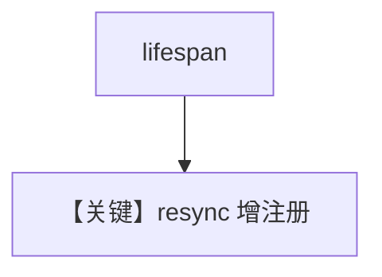

# update_from_lifespan.py — 实现原理分析

> 源文件：`cookbook/05_agent_os/customize/update_from_lifespan.py`

## 概述

**`lifespan(app, agent_os)`** 在启动时 **`agent_os.agents.append(agent2)`** 并 **`agent_os.resync(app=app)`** 动态注册第二 Agent；**`enable_mcp_server=True`**。**`agent1` 无 tools/db；`agent2` 有 MCPTools + db**。

## System Prompt 组装

两 Agent 均仅 `markdown=True` 为主显式配置；**无 instructions**。

## 完整 API 请求

动态加入的 **agent2** 使用 MCP 与模型（未显式 model 于 agent1）。

## Mermaid 流程图

## 关键源码文件索引

| 文件 | 作用 |
|------|------|
| `agno/os` | `resync` |
