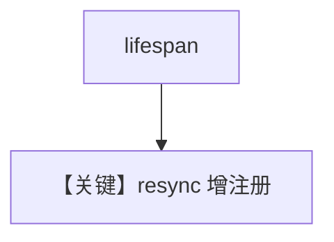

# update_from_lifespan.py — 实现原理分析

<!-- cookbook-py-source:start -->
## 完整源码

```python
"""
Update From Lifespan
====================

Demonstrates update from lifespan.
"""

from contextlib import asynccontextmanager

from agno.agent.agent import Agent
from agno.db.postgres.postgres import PostgresDb
from agno.os import AgentOS
from agno.tools.mcp import MCPTools

# ---------------------------------------------------------------------------
# Create Example
# ---------------------------------------------------------------------------

db = PostgresDb(id="basic-db", db_url="postgresql+psycopg://ai:ai@localhost:5532/ai")

# First agent. We will add this to the AgentOS on initialization.
agent1 = Agent(
    name="First Agent",
    markdown=True,
)

# Second agent. We will add this to the AgentOS in the lifespan function.
agent2 = Agent(
    id="second-agent",
    name="Second Agent",
    tools=[MCPTools(transport="streamable-http", url="https://docs.agno.com/mcp")],
    markdown=True,
    db=db,
)


# Lifespan function receiving the AgentOS instance as parameter.
@asynccontextmanager
async def lifespan(app, agent_os):
    # Add the new Agent
    agent_os.agents.append(agent2)

    # Resync the AgentOS
    agent_os.resync(app=app)

    yield


# Setup our AgentOS with the lifespan function and the first agent.
agent_os = AgentOS(
    lifespan=lifespan,
    agents=[agent1],
    enable_mcp_server=True,
)

# Get our app.
app = agent_os.get_app()

# Serve the app.
# ---------------------------------------------------------------------------
# Run Example
# ---------------------------------------------------------------------------

if __name__ == "__main__":
    agent_os.serve(app="update_from_lifespan:app", reload=True)
```

<!-- cookbook-py-source:end -->

> 源文件：`cookbook/05_agent_os/customize/update_from_lifespan.py`

## 概述

**`lifespan(app, agent_os)`** 在启动时 **`agent_os.agents.append(agent2)`** 并 **`agent_os.resync(app=app)`** 动态注册第二 Agent；**`enable_mcp_server=True`**。**`agent1` 无 tools/db；`agent2` 有 MCPTools + db**。

## System Prompt 组装

两 Agent 均仅 `markdown=True` 为主显式配置；**无 instructions**。

## 完整 API 请求

动态加入的 **agent2** 使用 MCP 与模型（未显式 model 于 agent1）。

## Mermaid 流程图



## 关键源码文件索引

| 文件 | 作用 |
|------|------|
| `agno/os` | `resync` |
