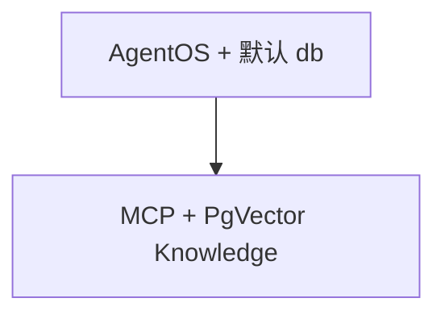

# agentos_default_db.py — 实现原理分析

<!-- cookbook-py-source:start -->
## 完整源码

```python
"""
AgentOS Demo

Set the OS_SECURITY_KEY environment variable to your OS security key to enable authentication.

Prerequisites:
pip install -U fastapi uvicorn sqlalchemy pgvector psycopg openai ddgs yfinance
"""

from agno.agent import Agent
from agno.db.postgres import PostgresDb
from agno.knowledge.knowledge import Knowledge
from agno.models.openai import OpenAIChat
from agno.os import AgentOS
from agno.tools.mcp import MCPTools
from agno.vectordb.pgvector import PgVector

# ---------------------------------------------------------------------------
# Create Example
# ---------------------------------------------------------------------------

# Database connection
db_url = "postgresql+psycopg://ai:ai@localhost:5532/ai"

# Create Postgres-backed memory store
db = PostgresDb(db_url=db_url)

# Create Postgres-backed vector store
vector_db = PgVector(
    db_url=db_url,
    table_name="agno_docs",
)
knowledge = Knowledge(
    name="Agno Docs",
    contents_db=db,
    vector_db=vector_db,
)

# Create your agents
agno_agent = Agent(
    name="Agno Agent",
    model=OpenAIChat(id="gpt-4.1"),
    tools=[MCPTools(transport="streamable-http", url="https://docs.agno.com/mcp")],
    knowledge=knowledge,
    markdown=True,
)

# Create the AgentOS
agent_os = AgentOS(
    id="agentos-demo",
    agents=[agno_agent],
    db=db,  # This is the default database for AgentOS, the agno_agent will use this
)
app = agent_os.get_app()


# ---------------------------------------------------------------------------
# Run Example
# ---------------------------------------------------------------------------

if __name__ == "__main__":
    agent_os.serve(app="agentos_default_db:app", port=7777, reload=True)
```

<!-- cookbook-py-source:end -->

> 源文件：`cookbook/05_agent_os/dbs/agentos_default_db.py`

## 概述

**`PostgresDb` + `PgVector` + `Knowledge`**；**`agno_agent`** 使用 **`MCPTools(streamable-http, docs.agno.com)`** 与 **`knowledge`**，**无 `search_knowledge` 显式**（需核对默认）。**`AgentOS(db=db)`** 将同一 DB 作为 OS 默认库。

**核心配置一览：**

| 配置项 | 值 | 说明 |
|--------|------|------|
| `model` | `OpenAIChat(id="gpt-4.1")` | 主模型 |
| `AgentOS.id` | `agentos-demo` | 与多 demo 重名注意环境 |

## System Prompt 组装

无显式 instructions；工具与知识段运行时注入。

## 完整 API 请求

`OpenAIChat` Chat Completions。

## Mermaid 流程图



## 关键源码文件索引

| 文件 | 作用 |
|------|------|
| `agno/os` | `db=` 默认存储 |
