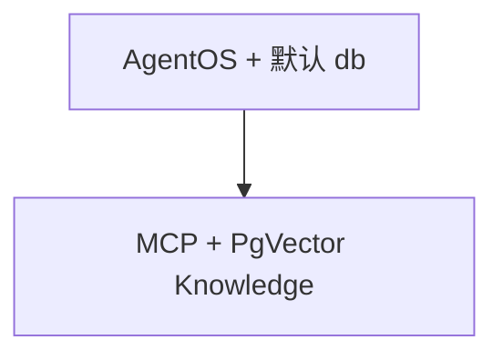

# agentos_default_db.py — 实现原理分析

> 源文件：`cookbook/05_agent_os/dbs/agentos_default_db.py`

## 概述

**`PostgresDb` + `PgVector` + `Knowledge`**；**`agno_agent`** 使用 **`MCPTools(streamable-http, docs.agno.com)`** 与 **`knowledge`**，**无 `search_knowledge` 显式**（需核对默认）。**`AgentOS(db=db)`** 将同一 DB 作为 OS 默认库。

**核心配置一览：**

| 配置项 | 值 | 说明 |
|--------|------|------|
| `model` | `OpenAIChat(id="gpt-4.1")` | 主模型 |
| `AgentOS.id` | `agentos-demo` | 与多 demo 重名注意环境 |

## System Prompt 组装

无显式 instructions；工具与知识段运行时注入。

## 完整 API 请求

`OpenAIChat` Chat Completions。

## Mermaid 流程图

## 关键源码文件索引

| 文件 | 作用 |
|------|------|
| `agno/os` | `db=` 默认存储 |
