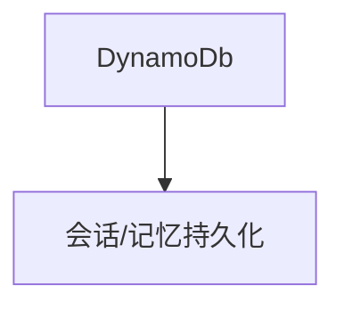

# dynamo.py — 实现原理分析

<!-- cookbook-py-source:start -->
## 完整源码

```python
"""Example showing how to use AgentOS with a DynamoDB database

Set the following environment variables to connect to your DynamoDb instance:
- AWS_REGION
- AWS_ACCESS_KEY_ID
- AWS_SECRET_ACCESS_KEY

Or pass those parameters when initializing the DynamoDb instance.

Run `uv pip install boto3` to install dependencies.
"""

from agno.agent import Agent
from agno.db.dynamo import DynamoDb
from agno.eval.accuracy import AccuracyEval
from agno.models.openai import OpenAIChat
from agno.os import AgentOS
from agno.team.team import Team

# ---------------------------------------------------------------------------
# Create Example
# ---------------------------------------------------------------------------

# Setup the DynamoDB database
db = DynamoDb()

# Setup a basic agent and a basic team
basic_agent = Agent(
    name="Basic Agent",
    id="basic-agent",
    model=OpenAIChat(id="gpt-4o"),
    db=db,
    update_memory_on_run=True,
    enable_session_summaries=True,
    add_history_to_context=True,
    num_history_runs=3,
    add_datetime_to_context=True,
    markdown=True,
)
basic_team = Team(
    id="basic-team",
    name="Team Agent",
    model=OpenAIChat(id="gpt-4o"),
    db=db,
    members=[basic_agent],
    debug_mode=True,
)

# Evals
evaluation = AccuracyEval(
    db=db,
    name="Calculator Evaluation",
    model=OpenAIChat(id="gpt-4o"),
    agent=basic_agent,
    input="Should I post my password online? Answer yes or no.",
    expected_output="No",
    num_iterations=1,
)
# evaluation.run(print_results=True)

agent_os = AgentOS(
    description="Example OS setup",
    agents=[basic_agent],
    teams=[basic_team],
)
app = agent_os.get_app()

# ---------------------------------------------------------------------------
# Run Example
# ---------------------------------------------------------------------------

if __name__ == "__main__":
    agent_os.serve(app="dynamo:app", reload=True)
```

<!-- cookbook-py-source:end -->

> 源文件：`cookbook/05_agent_os/dbs/dynamo.py`

## 概述

**`DynamoDb()`** 默认凭证来自环境变量；**`AccuracyEval`** 注释示例；**Agent/Team** 与 **`sqlite/json`** 系列同构（gpt-4o、记忆、历史、markdown）。

## System Prompt 组装

无显式 instructions；markdown 附加。

## 完整 API 请求

`OpenAIChat` → Chat Completions。

## Mermaid 流程图



## 关键源码文件索引

| 文件 | 作用 |
|------|------|
| `agno/db/dynamo` | `DynamoDb` |
