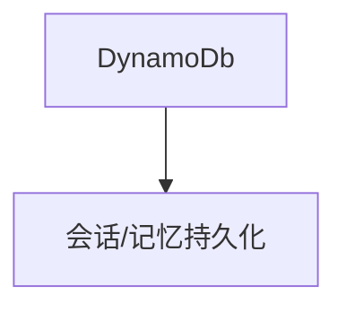

# dynamo.py — 实现原理分析

> 源文件：`cookbook/05_agent_os/dbs/dynamo.py`

## 概述

**`DynamoDb()`** 默认凭证来自环境变量；**`AccuracyEval`** 注释示例；**Agent/Team** 与 **`sqlite/json`** 系列同构（gpt-4o、记忆、历史、markdown）。

## System Prompt 组装

无显式 instructions；markdown 附加。

## 完整 API 请求

`OpenAIChat` → Chat Completions。

## Mermaid 流程图

## 关键源码文件索引

| 文件 | 作用 |
|------|------|
| `agno/db/dynamo` | `DynamoDb` |
