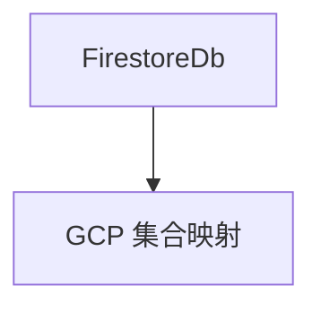

# firestore.py — 实现原理分析

> 源文件：`cookbook/05_agent_os/dbs/firestore.py`

## 概述

**`FirestoreDb(project_id=...)`** 配置多 collection；**`__main__` 先 `basic_agent.run(...)` 写记忆再 `serve`**。

## System Prompt 组装

默认 Agent 无 instructions；markdown+时间+历史。

## 完整 API 请求

`OpenAIChat`。

## Mermaid 流程图

## 关键源码文件索引

| 文件 | 作用 |
|------|------|
| `agno/db/firestore` | `FirestoreDb` |
