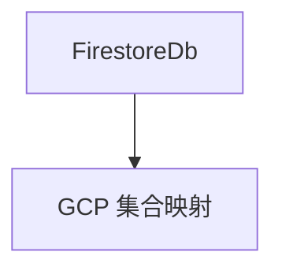

# firestore.py — 实现原理分析

<!-- cookbook-py-source:start -->
## 完整源码

```python
"""Example showing how to use AgentOS with a Firestore database"""

from agno.agent import Agent
from agno.db.firestore import FirestoreDb
from agno.eval.accuracy import AccuracyEval
from agno.models.openai import OpenAIChat
from agno.os import AgentOS
from agno.team.team import Team

# ---------------------------------------------------------------------------
# Create Example
# ---------------------------------------------------------------------------

PROJECT_ID = "agno-os-test"

# Setup the Firestore database
db = FirestoreDb(
    project_id=PROJECT_ID,
    session_collection="sessions",
    eval_collection="eval_runs",
    memory_collection="user_memories",
    metrics_collection="metrics",
    knowledge_collection="knowledge",
)

# Setup a basic agent and a basic team
basic_agent = Agent(
    name="Basic Agent",
    id="basic-agent",
    model=OpenAIChat(id="gpt-4o"),
    db=db,
    update_memory_on_run=True,
    enable_session_summaries=True,
    add_history_to_context=True,
    num_history_runs=3,
    add_datetime_to_context=True,
    markdown=True,
)
basic_team = Team(
    id="basic-team",
    name="Team Agent",
    model=OpenAIChat(id="gpt-4o"),
    db=db,
    update_memory_on_run=True,
    members=[basic_agent],
    debug_mode=True,
)

# Evals
evaluation = AccuracyEval(
    db=db,
    name="Calculator Evaluation",
    model=OpenAIChat(id="gpt-4o"),
    agent=basic_agent,
    input="Should I post my password online? Answer yes or no.",
    expected_output="No",
    num_iterations=1,
)
# evaluation.run(print_results=True)

agent_os = AgentOS(
    description="Example app for basic agent with Firestore database capabilities",
    id="firestore-app",
    agents=[basic_agent],
    teams=[basic_team],
)
app = agent_os.get_app()

# ---------------------------------------------------------------------------
# Run Example
# ---------------------------------------------------------------------------

if __name__ == "__main__":
    basic_agent.run("Please remember I really like French food")
    agent_os.serve(app="firestore:app", reload=True)
```

<!-- cookbook-py-source:end -->

> 源文件：`cookbook/05_agent_os/dbs/firestore.py`

## 概述

**`FirestoreDb(project_id=...)`** 配置多 collection；**`__main__` 先 `basic_agent.run(...)` 写记忆再 `serve`**。

## System Prompt 组装

默认 Agent 无 instructions；markdown+时间+历史。

## 完整 API 请求

`OpenAIChat`。

## Mermaid 流程图



## 关键源码文件索引

| 文件 | 作用 |
|------|------|
| `agno/db/firestore` | `FirestoreDb` |
