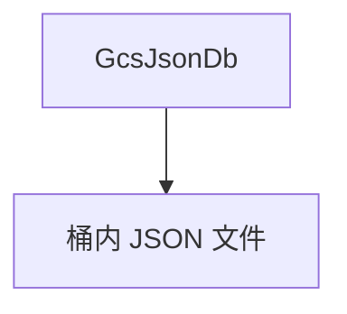

# gcs_json.md — 实现原理分析

<!-- cookbook-py-source:start -->
## 完整源码

```python
"""
Example showing how to use AgentOS with JSON files hosted in GCS as database.

GCS JSON Database Setup:
- Uses JSON files stored in Google Cloud Storage as a lightweight database
- Only requires a GCS bucket name - authentication follows the standard GCP patterns:
  * Local development: `gcloud auth application-default login`
  * Production: Set GOOGLE_APPLICATION_CREDENTIALS env var to service account key path
  * GCP instances: Uses instance metadata automatically
- Optional prefix parameter for organizing files (defaults to empty string)
- Automatically creates JSON files in the bucket as needed

Prerequisites:
1. Create a GCS bucket
2. Ensure proper GCS permissions
3. Install google-cloud-storage: `uv pip install google-cloud-storage`
"""

from agno.agent import Agent
from agno.db.gcs_json import GcsJsonDb
from agno.eval.accuracy import AccuracyEval
from agno.models.openai import OpenAIChat
from agno.os import AgentOS
from agno.team.team import Team

# ---------------------------------------------------------------------------
# Create Example
# ---------------------------------------------------------------------------

# Setup the GCS JSON database
db = GcsJsonDb(bucket_name="agno_tests")


# Setup a basic agent and a basic team
agent = Agent(
    name="JSON Demo Agent",
    id="basic-agent",
    model=OpenAIChat(id="gpt-4o"),
    db=db,
    update_memory_on_run=True,
    enable_session_summaries=True,
    add_history_to_context=True,
    num_history_runs=3,
    add_datetime_to_context=True,
    markdown=True,
)

team = Team(
    id="basic-team",
    name="JSON Demo Team",
    model=OpenAIChat(id="gpt-4o"),
    db=db,
    members=[agent],
    debug_mode=True,
)

# Evaluation example
evaluation = AccuracyEval(
    db=db,
    name="JSON Demo Evaluation",
    model=OpenAIChat(id="gpt-4o"),
    agent=agent,
    input="What is 2 + 2?",
    expected_output="4",
    num_iterations=1,
)
# evaluation.run(print_results=True)

# Create the AgentOS instance
agent_os = AgentOS(
    id="json-demo-app",
    description="Example app using JSON file database for simple deployments and demos",
    agents=[agent],
    teams=[team],
)

app = agent_os.get_app()

# ---------------------------------------------------------------------------
# Run Example
# ---------------------------------------------------------------------------

if __name__ == "__main__":
    agent_os.serve(app="gcs_json:app", reload=True)
```

<!-- cookbook-py-source:end -->

> 源文件：`cookbook/05_agent_os/dbs/gcs_json.py`

## 概述

**`GcsJsonDb(bucket_name="agno_tests")`**：GCS 桶存 JSON 状态；Agent/Team/Eval 模式同 **`json_db.py`**。

## System Prompt 组装

同其他 basic agent 示例。

## 完整 API 请求

`OpenAIChat`。

## Mermaid 流程图



## 关键源码文件索引

| 文件 | 作用 |
|------|------|
| `agno/db/gcs_json` | `GcsJsonDb` |
