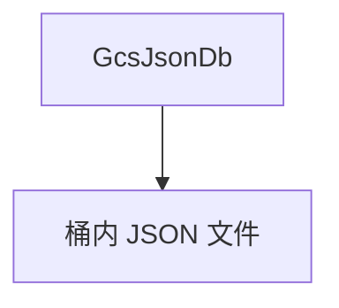

# gcs_json.md — 实现原理分析

> 源文件：`cookbook/05_agent_os/dbs/gcs_json.py`

## 概述

**`GcsJsonDb(bucket_name="agno_tests")`**：GCS 桶存 JSON 状态；Agent/Team/Eval 模式同 **`json_db.py`**。

## System Prompt 组装

同其他 basic agent 示例。

## 完整 API 请求

`OpenAIChat`。

## Mermaid 流程图

## 关键源码文件索引

| 文件 | 作用 |
|------|------|
| `agno/db/gcs_json` | `GcsJsonDb` |
