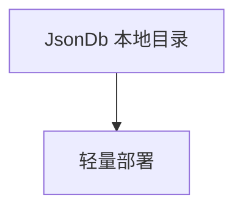

# json_db.py — 实现原理分析

<!-- cookbook-py-source:start -->
## 完整源码

```python
"""Example showing how to use AgentOS with JSON files as database"""

from agno.agent import Agent
from agno.db.json import JsonDb
from agno.eval.accuracy import AccuracyEval
from agno.models.openai import OpenAIChat
from agno.os import AgentOS
from agno.team.team import Team

# ---------------------------------------------------------------------------
# Create Example
# ---------------------------------------------------------------------------

# Setup the JSON database
db = JsonDb(db_path="./agno_json_data")

# Setup a basic agent and a basic team
agent = Agent(
    name="JSON Demo Agent",
    id="basic-agent",
    model=OpenAIChat(id="gpt-4o"),
    db=db,
    update_memory_on_run=True,
    enable_session_summaries=True,
    add_history_to_context=True,
    num_history_runs=3,
    add_datetime_to_context=True,
    markdown=True,
)

team = Team(
    id="basic-team",
    name="JSON Demo Team",
    model=OpenAIChat(id="gpt-4o"),
    db=db,
    members=[agent],
    debug_mode=True,
)

# Evaluation example
evaluation = AccuracyEval(
    db=db,
    name="JSON Demo Evaluation",
    model=OpenAIChat(id="gpt-4o"),
    agent=agent,
    input="What is 2 + 2?",
    expected_output="4",
    num_iterations=1,
)
# evaluation.run(print_results=True)

# Create the AgentOS instance
agent_os = AgentOS(
    id="json-demo-app",
    description="Example app using JSON file database for simple deployments and demos",
    agents=[agent],
    teams=[team],
)

app = agent_os.get_app()

# ---------------------------------------------------------------------------
# Run Example
# ---------------------------------------------------------------------------

if __name__ == "__main__":
    agent_os.serve(app="json_db:app", reload=True)
```

<!-- cookbook-py-source:end -->

> 源文件：`cookbook/05_agent_os/dbs/json_db.py`

## 概述

**`JsonDb(db_path="./agno_json_data")`**；**`id="json-demo-app"`** 的 AgentOS；**AccuracyEval** 注释。

## System Prompt 组装

无显式 instructions。

## 完整 API 请求

`OpenAIChat`。

## Mermaid 流程图



## 关键源码文件索引

| 文件 | 作用 |
|------|------|
| `agno/db/json` | `JsonDb` |
