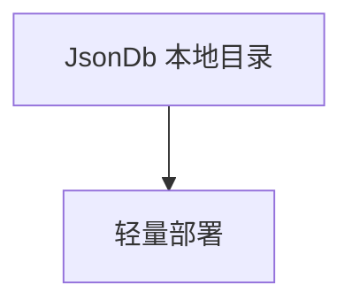

# json_db.py — 实现原理分析

> 源文件：`cookbook/05_agent_os/dbs/json_db.py`

## 概述

**`JsonDb(db_path="./agno_json_data")`**；**`id="json-demo-app"`** 的 AgentOS；**AccuracyEval** 注释。

## System Prompt 组装

无显式 instructions。

## 完整 API 请求

`OpenAIChat`。

## Mermaid 流程图

## 关键源码文件索引

| 文件 | 作用 |
|------|------|
| `agno/db/json` | `JsonDb` |
