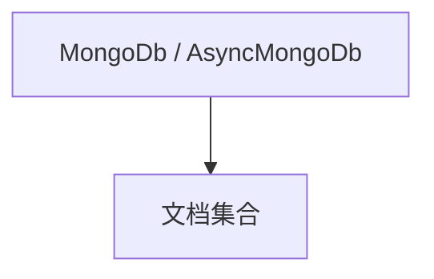

# mongo.md — 实现原理分析

> 源文件：`cookbook/05_agent_os/dbs/mongo.py`

## 概述

**同步 `MongoDb` + 异步 `AsyncMongoDb`** 两套；各配 **Agent/Team/Eval/OS**；默认 **`agent_os = sync_agent_os`**，注释可切换 **`async_agent_os`**。**async 集合名 `sessionss222` 拼写注意**。

## System Prompt 组装

同 gpt-4o basic 模板。

## 完整 API 请求

`OpenAIChat`。

## Mermaid 流程图

## 关键源码文件索引

| 文件 | 作用 |
|------|------|
| `agno/db/mongo` | `MongoDb`, `AsyncMongoDb` |
