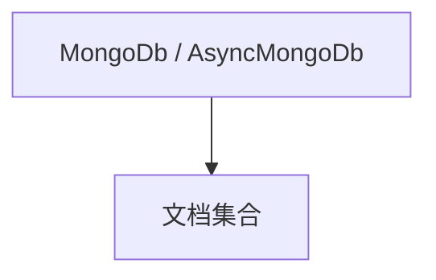

# mongo.md — 实现原理分析

<!-- cookbook-py-source:start -->
## 完整源码

```python
"""
Mongo Database Backend
======================

Demonstrates AgentOS with MongoDB storage using both sync and async setups.
"""

from agno.agent import Agent
from agno.db.mongo import AsyncMongoDb, MongoDb
from agno.eval.accuracy import AccuracyEval
from agno.models.openai import OpenAIChat
from agno.os import AgentOS
from agno.team.team import Team

# ---------------------------------------------------------------------------
# Setup
# ---------------------------------------------------------------------------
sync_db = MongoDb(db_url="mongodb://localhost:27017")

async_db = AsyncMongoDb(
    db_url="mongodb://localhost:27017",
    session_collection="sessionss222",
)

# ---------------------------------------------------------------------------
# Create Sync Agent, Team, Eval, And AgentOS
# ---------------------------------------------------------------------------
sync_agent = Agent(
    name="Basic Agent",
    id="basic-agent",
    model=OpenAIChat(id="gpt-4o"),
    db=sync_db,
    update_memory_on_run=True,
    enable_session_summaries=True,
    add_history_to_context=True,
    num_history_runs=3,
    add_datetime_to_context=True,
    markdown=True,
)

sync_team = Team(
    id="basic-team",
    name="Team Agent",
    model=OpenAIChat(id="gpt-4o"),
    db=sync_db,
    members=[sync_agent],
)

sync_evaluation = AccuracyEval(
    db=sync_db,
    name="Calculator Evaluation",
    model=OpenAIChat(id="gpt-4o"),
    agent=sync_agent,
    input="Should I post my password online? Answer yes or no.",
    expected_output="No",
    num_iterations=1,
)
# sync_evaluation.run(print_results=True)

sync_agent_os = AgentOS(
    description="Example OS setup",
    agents=[sync_agent],
    teams=[sync_team],
)

# ---------------------------------------------------------------------------
# Create Async Agent, Team, Eval, And AgentOS
# ---------------------------------------------------------------------------
async_agent = Agent(
    name="Basic Agent",
    id="basic-agent",
    model=OpenAIChat(id="gpt-4o"),
    db=async_db,
    update_memory_on_run=True,
    enable_session_summaries=True,
    add_history_to_context=True,
    num_history_runs=3,
    add_datetime_to_context=True,
    markdown=True,
)

async_team = Team(
    id="basic-team",
    name="Team Agent",
    model=OpenAIChat(id="gpt-4o"),
    db=async_db,
    members=[async_agent],
)

async_evaluation = AccuracyEval(
    db=async_db,
    name="Calculator Evaluation",
    model=OpenAIChat(id="gpt-4o"),
    agent=async_agent,
    input="Should I post my password online? Answer yes or no.",
    expected_output="No",
    num_iterations=1,
)
# async_evaluation.run(print_results=True)

async_agent_os = AgentOS(
    description="Example OS setup",
    agents=[async_agent],
    teams=[async_team],
)

# ---------------------------------------------------------------------------
# Create AgentOS App
# ---------------------------------------------------------------------------
# Default to the sync setup. Switch to async_agent_os to run the async variant.
agent_os = sync_agent_os
app = agent_os.get_app()

# ---------------------------------------------------------------------------
# Run
# ---------------------------------------------------------------------------
if __name__ == "__main__":
    agent_os.serve(app="mongo:app", reload=True)
```

<!-- cookbook-py-source:end -->

> 源文件：`cookbook/05_agent_os/dbs/mongo.py`

## 概述

**同步 `MongoDb` + 异步 `AsyncMongoDb`** 两套；各配 **Agent/Team/Eval/OS**；默认 **`agent_os = sync_agent_os`**，注释可切换 **`async_agent_os`**。**async 集合名 `sessionss222` 拼写注意**。

## System Prompt 组装

同 gpt-4o basic 模板。

## 完整 API 请求

`OpenAIChat`。

## Mermaid 流程图



## 关键源码文件索引

| 文件 | 作用 |
|------|------|
| `agno/db/mongo` | `MongoDb`, `AsyncMongoDb` |
